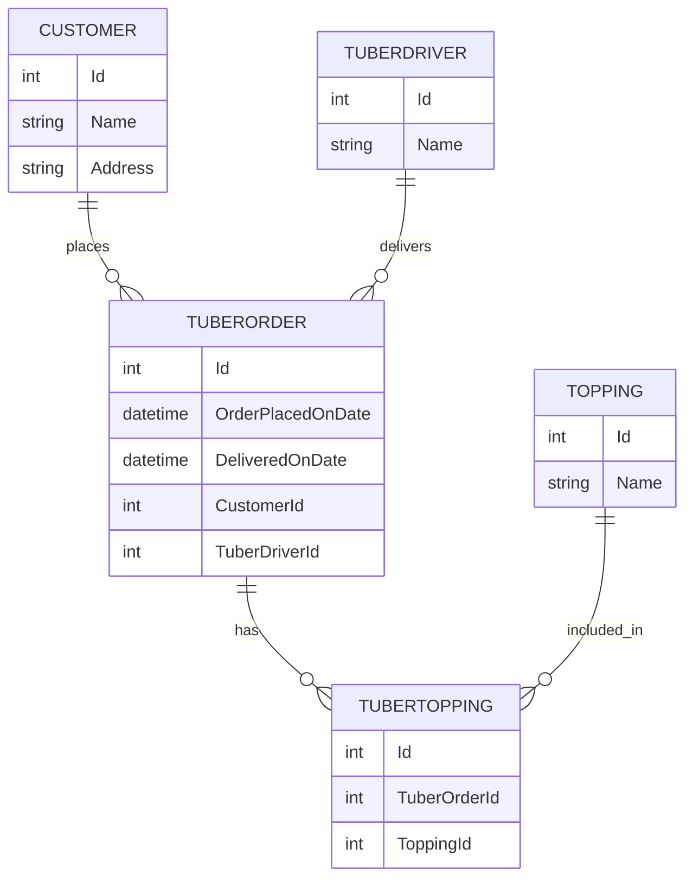

# Entity Relationship Diagram (ERD)

The following schema describes the entity relationships for the Tuber Treats system.

## DBML format:

```dbml
Table Customer {
  Id int [pk]
  Name varchar
  Address varchar
}

Table TuberOrder {
  Id int [pk]
  OrderPlacedOnDate datetime
  DeliveredOnDate datetime [null]
  CustomerId int [ref: > Customer.Id]
  TuberDriverId int [ref: > TuberDriver.Id, null]
}

Table Topping {
  Id int [pk]
  Name varchar
}

Table TuberTopping {
  Id int [pk]
  TuberOrderId int [ref: > TuberOrder.Id]
  ToppingId int [ref: > Topping.Id]
}

Table TuberDriver {
  Id int [pk]
  Name varchar
}
```
## Mermaid Format:

